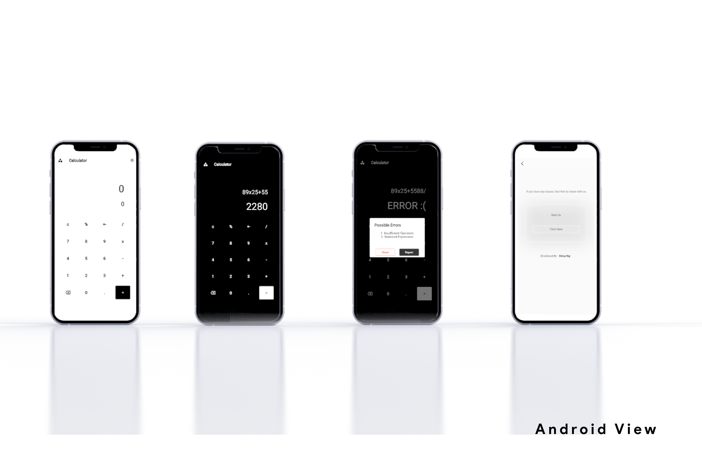
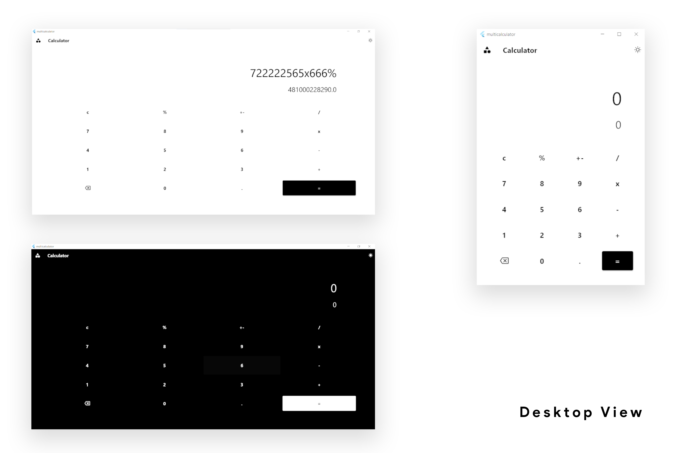
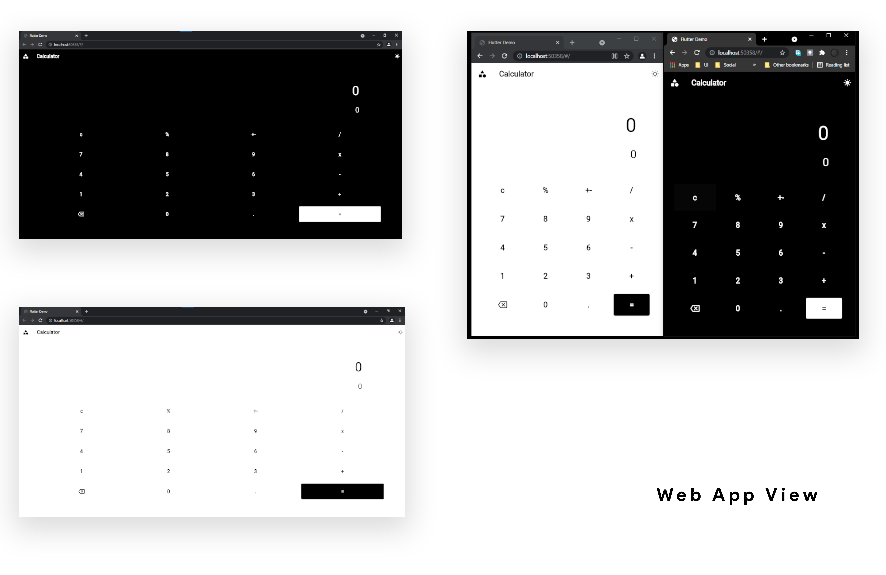

  

###### made with <a href="https://flutter.dev/"> Flutter </a>
# MultiPlatformCalculator🧮
a cross-platform Calculator app available as WebApp, Desktop App(Windows), Android App🎉.The app provides standard  calculator functionality, as well as it comes with dark and light mode .

## Features✨
* Standard Operations (Addition, Multiplication.....etc 😉)
* You can copy the result or formula to clipboard 
* You can choose dark/light theme
 

## Requirements🎫
###### for runing this code
- [x] Android Studio running on windows/mac os
- [x] Flutter 2.0 or higher set up
- [x] Android Phone/Emulator | Chrome/Edge | Desktop SetUp For Flutter [ <a href="https://flutter.dev/desktop"> Read More </a>  👈 ] 

## Get It🎊

##### android app

##### web app 

##### desktop app

## Views😳🤩

  

---

  

---

  

## Contribute ⚽

Feel free to submit issues and enhancement requests. 🤗

## Reporting Any Issues 🧨

Ping me <a href="mailto:dinoykraj@gmail.com">📧</a> <a href="https://wa.me/+917306185390">📞</a>
